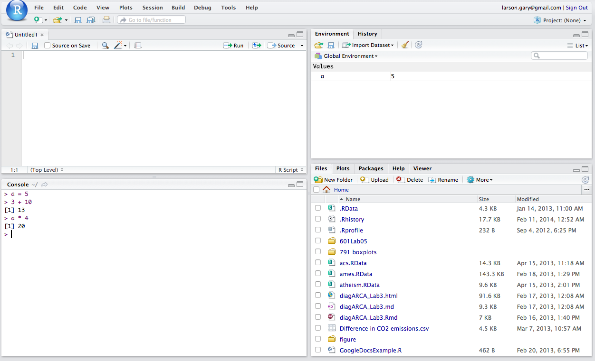
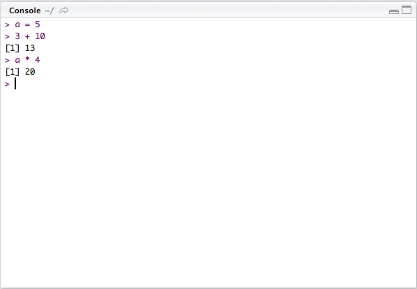
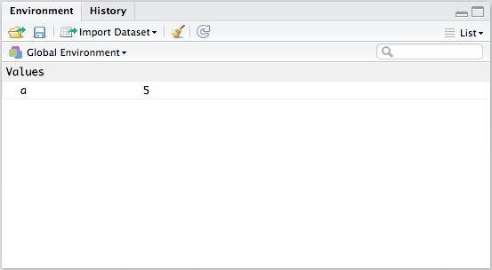
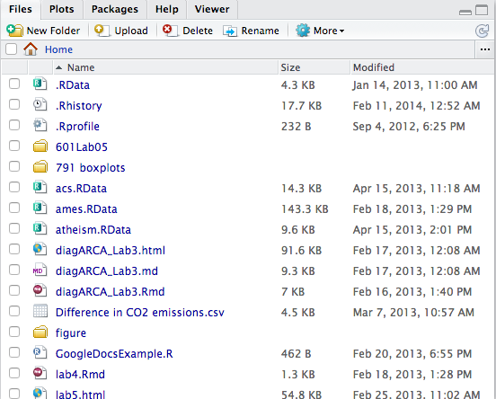
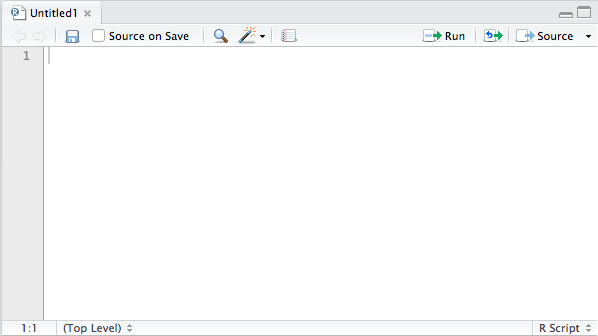
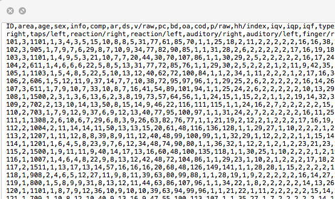
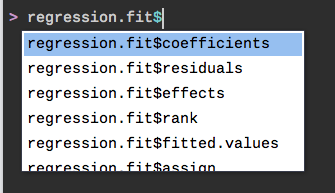

<!--
# This section heading has its own page.
## This, title of a slide, starts a new slide.
### Here's a heading within a slide. Four # signs does nothing.

Here is some **bold** text.

- This starts a list
    - This continues a list.
    
Here is some R code that won't evaluate. Note how the chunk name is defined.
```{r chunk-name, eval=FALSE}
dim(arbuthnot)
print('Hello!')
```
-->

## Outline

- Download and Install R and RStudio
- RStudio layout
- Loading data
- R packages
- Exploratory data analysis ("EDA")
    - Working with subsets of the data
- Basic statistics functionality
- Where to get help

## Downloading/Installing R and RStudio

1. **R (the programming language)** - http://cran.r-project.org/
2. **RStudio (the IDE)** - http://www.rstudio.com/



# RStudio layout
## RStudio layout


## Rstudio layout: the 4 panes.
- Lower-left: **Console** (where the action happens): 
    - Shows a one-line "command prompt" as well as a line-by-line history of recently-executed commands.
    
- Upper-right: **Environment (or Workspace)** and **History**
    - **Environment** - names/properties of variables, datasets, etc.
    - **History** - shows previously-executed commands
    - The important button **"import dataset"** is also shown in the upper-right.

- Lower-right: Any plots that you generate will appear here in under **Plots**.
    - This is also where you can access your **files**, view/install **packages**, and view **help**.
    
- Upper-left: **Scripts**. Write and save scripts here. Scripts are sequences of commands you can easily re-run all at once, share with a teammate, etc.

## RStudio layout: Console
Lower-left:

- Where the action happens: 
    - Shows a one-line command prompt as well as a line-by-line history of recently-executed commands.
    - Press "Up" to cycle through previously-entered commands.
    


## RStudio layout: Environment / History
Upper-right:

- Your **Environment** shows names/properties of variables, datasets, etc.
- The **History** tab shows the commands that you’ve previously executed
- The important button **"import dataset"** is also shown in the upper-right.



## RStudio layout: The viewer
Lower-right:

- Any plots that you generate will appear here in the **Plots** tab.
- You can also access your **Files**, view/install R **packages**, and view R **help**.



## RStudio layout: Script Window
Upper-left:

- Write and save scripts here. Scripts are sequences of commands you can easily re-run all at once, share with a teammate, etc.
- "**Start** in the console, **save** in a script."




# Loading datasets into R
## What is a .csv file?
"Comma separated values", i.e. commas are the **delimiter**.


## Getting this dataset / presentation

- The `DFworkshop.csv` dataset used in this presentation is available at

http://tinyurl.com/df15-introToR-data
    
- The **R script** containing all of the R code from this presentation can be found at 

http://tinyurl.com/df15-introToR-code

- The slides for this presentation can be found at

http://tinyurl.com/df2016-introToR-slides or
http://tinyurl.com/df16-introToR-slides

- All other files (source code, etc.) can be found at

http://tinyurl.com/df15-introToR-source

## Loading a large .csv dataset Method 1
### By point-and-click
Datasets in R are stored as follows:

- Each of the **n** rows is an individual case, i.e. an observation.
- Each of the **p** columns is a variable which was recorded for each observation.

Save the .csv file to a directory on your computer (e.g. your Dropbox). Then, to load the data into a variable called `myData`:

- use the Import Dataset button in the upper-left pane.
    - [DEMO]

## Loading a large .csv dataset Method 2
### By read.csv()
Datasets in R are stored as follows:

- Each of the **n** rows is an individual case, i.e. an observation.
- Each of the **p** columns is a variable which was recorded for each observation.

Save the .csv file to a directory on your computer (e.g. your Dropbox). Then, to load the data into a variable called `myData`:

- execute `read.csv()` with the following arguments:

```{r loadCSV, eval = TRUE}
myData = read.csv("DFworkshop.csv", comment.char = "", quote = "",
                  stringsAsFactors = FALSE)
```

- **TIP**: Write your commands in the **script** window so they're easily accessible.

## A quick look at the data we loaded
```{r quickLook, eval=TRUE}
dim(myData)    # "dimension"
names(myData)
```
- `dim()` shows us the data has 99 rows (observations) and 9 columns (variables).
- `names()` shows us the dataset's variable names


## More on read.csv() 
The function `read.csv()` has lots of optional arguments.

- The DataFest data should be readable using the `read.csv()` command listed earlier, with similar arguments. (Ask a DataFest consultant!)
- Get more info on the function by executing `?read.csv`;  RStudio's Help window will appear.
- Examples of arguments for `myData = read.csv(...)` (e.g. for other datasets) are:
     - `file = 'data.csv', header = TRUE, sep = "|", stringsAsFactors = FALSE, nrows = 5`
     - `file = 'data.csv', header = FALSE, stringsAsFactors = FALSE, sep = ",")`

## Using R packages
- Lots of R's capabilities aren't available in the basic download. 
- Often, external **packages**  need to be **installed** and **loaded** first.

```{r instPkg, eval=FALSE}
install.packages("mosaic")  # "" mandatory
library("mosaic")           # "" optional
```
**IMPORTANT**: These two commands must **both** be used, or the package's functions won't be accessible to you.

# EDA </br> Summary statistics
## categorical variables
```{r summary, eval=TRUE }
table(myData$state)
table(myData$type)
```

## continous variables
```{r contVars, eval=TRUE}
summary(myData$var6)
summary(myData$var7)
```

# EDA </br> Some basics
## Basics
Most basic functionality is available standard -- i.e. without having to install a package
```{r basic, eval=TRUE}
mean(myData$var6)  # mean
sd(myData$var7)    # standard deviation
```

## Histogram of a continous variable
Plotting histogram with `hist()` function
```{r histFn, eval=TRUE, fig.height=3.5}
hist(myData$var6)
```

## Histogram of a continous variable: var6
You can adjust the width of the bins by changing the `breaks` argument
```{r histFn2, eval=TRUE, fig.height=3.5}
hist(myData$var6, breaks = 20)
```

## Histogram of a continous variable: var6
Axis labels are controlled by `xlab` and `ylab`; the title by `main`
```{r moreArgs, eval=TRUE, fig.height=3.5}
hist(myData$var6, xlab = "Variable 6", ylab = "counts",
     main = "Histogram of Variable 6", breaks = 20)
```

# EDA </br> Working with subsets of the data
## Histograms with subsets
Here we access the `var6` variable in the dataset with `myData$var6`, and further refine the command by accessing only those elements where `type` is `1`:
```{r subsets, eval=TRUE, fig.height=2.5, fig.width=6}
hist(myData$var6[myData$type == 1], xlab = "Variable 6", 
     ylab = "counts", main = "Histogram of Variable 6 of type 1")
```

This shows the important ability to access a particular index/indices of a 1-d **vector** using `vector[indices]`.

## Comparing two categorical variables
Get a quick summary using a contingency table with the **table** command.
```{r contTable, eval=TRUE}
table(myData$type, myData$state)
```

So, for example, the number of observations (rows of the dataset) with `type == 4` and `state == 'WA'` is 25.

## Comparing a continous variable across different groups
```{r boxplots, eval=FALSE}
boxplot(myData$var6 ~ myData$type, ylab = "Variable 6", 
        main = "Boxplot of Variable 6")
```

- Get a quick summary using side-by-side boxplots. Here we compare the continuous `var6` variable of `myData` by making a boxplot for those data points belonging to each level of `type`.

- For clarity, consider the above command without the extra label and title arguments: `boxplot(myData$var6 ~ myData$type)`. This just says "boxplot the continous `var6` variable of `myData`, breaking out the data by levels of the categorical `type` variable."

## Comparing a continous variable across different groups
```{r boxplots2, eval=TRUE}
boxplot(myData$var6 ~ myData$type, ylab = "Variable 6", 
        main = "Boxplot of Variable 6")
```

# More on basic statistical functionality
## t-test for a difference between means
```{r tTest, eval=TRUE}
t.test(var6 ~ group, data = myData)
```
The `na.rm = ...` argument ignores the NA values in the dataset. 

## t-test for a difference between means
Instead of 
```{r tTest2, eval=FALSE}
t.test(var6 ~ group, data = myData)
```
we could have executed 
```{r tTest3, eval=FALSE}
t.test(myData$var6 ~ myData$group)
```

- The first command is easier to read thanks to the `data = ` argument. 
- The `data = ` argument can be used in many R functions, **but not all**! 
- So give it a try, but if you get errors remember that the longer way of referring to variables, `data$variable`, is always available.


## Correlation
Let's calculate the correlation between two variables.
```{r corr, eval=FALSE}
# requires "mosaic" package
cor(var6, var7, data = myData)  
```
Again, we could have also written
```{r corr2, eval=TRUE}
# will work regardless of whether "mosaic" is loaded
cor(myData$var6, myData$var7)
```

## Regression
Regression is performed by passing a regression formula to the `lm()` function. The formula will look like:

`dependVar ~ indepVar1 + indepVar2 + [etc]`

where [etc] is whatever other variables you want to regress on. 

1. Store the result of `lm()` in a variable. Below we call it `regression.fit`.
2. View the results by using the `summary()` command on the variable you just created.

```{r slr, eval=TRUE}
regression.fit = lm(var7 ~ var6, data = myData)  # perform and store the regression
```

## Regression (cont'd)
View the results of a linear regression with `summary()`
```{r slrView, eval=FALSE, fig.height=1}
summary(regression.fit)  # view the results
```

## Regression (cont'd)
```{r slrView2, eval=TRUE, echo=FALSE}
summary(regression.fit)  # view the results
```

## Regression (cont'd)

- Often, related R commands can be combined to make code more concise, but harder to read depending on your experience. 
- Here's how to perform and view a regression in one line of code:

```{r slrShort, eval=FALSE}
summary(lm(var7 ~ var6, data=myData)) 
```

Note that if we use the latter command, the `regression.fit` variable wouldn't exist (so we can't refer to it later).

## Regression (cont'd) and code completion
If you stored the results of a regression as in 
```{r tabViewChunk, eval=FALSE}
regression.fit = lm(var7 ~ var6, data=myData)
```
you can easily exploit RStudio's code-completion feature. 

- Don't remember what's in variable? Easy... 
- ... just type the **variable name** (into the **command prompt** or a **script window**) followed by a `$` sign and press **TAB**.



## Basic plotting
```{r plot, eval=FALSE}
plot(myData$var6, myData$var7, xlab = "var6", ylab = "var7", 
     main = "regr. var7 vs. var6")
abline(regression.fit)
```

Earlier arguments like `xlab`, `ylab`, etc. can also be used with the `plot()` command.

## Basic plotting
```{r plot2, eval=TRUE}
plot(myData$var6, myData$var7, xlab = "var6", ylab = "var7", 
     main = "regr. var7 vs. var6")
abline(regression.fit)
```

`abline(lm(...))` will plot the line of best fit.

## Where to get help

1. To view documentation on any **function**, execute `?plot`, `?lm`, etc.
2. R command summaries and cheat sheets are all over the internet: e.g. https://www.zoology.ubc.ca/~schluter/R/data/ is a good one.
3. Of course, also ask a DataFest participant / helper!
4. If all else fails, listen to your heart ... Google it.